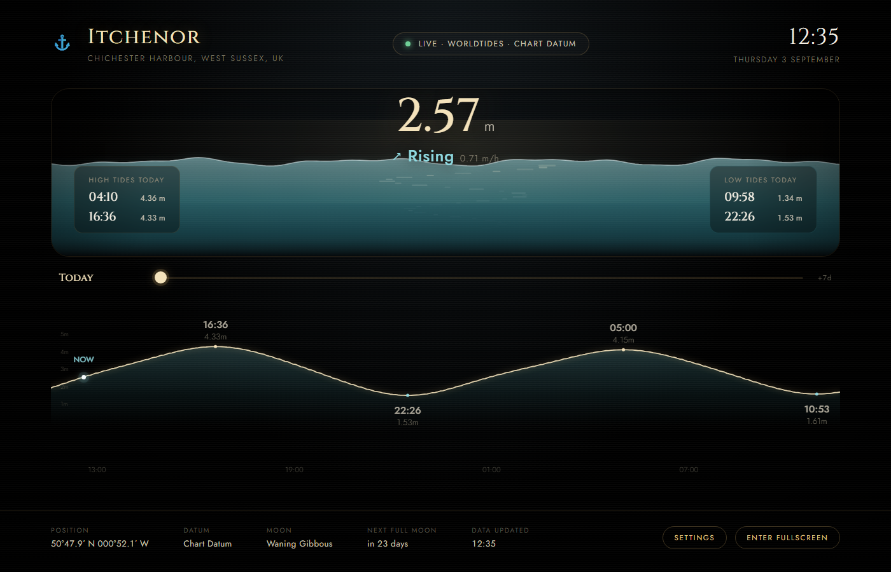

# Tide Bridge Display

**[Live Demo](https://tideviewer.com/)** — open it,
enter any harbour and a free [WorldTides](https://www.worldtides.info/register)
API key, and it's yours. No install, no account, no App Store.



A fullscreen, OLED-friendly tide display styled like an instrument on a
superyacht bridge — originally built for Itchenor, Chichester Harbour,
but works anywhere: **any visitor can point it at their own harbour**,
entirely from the browser, no code editing required. Plain HTML/CSS/
JavaScript — no build step, no frameworks, no backend.

The centrepiece is a live, continuously-scrolling water-level curve rather
than a table of times. Current level, trend, and the day's tides update
automatically every minute; the underlying prediction data refreshes from
a live API every few hours. A slider under the curve scrubs up to 7 days
into the future.

## 1. First launch: set your location and API key

The first time the page loads with nothing saved yet, it shows a setup
screen instead of the live display — no `js/config.js` editing needed:

1. Enter a location name and its latitude/longitude (or tap **"Use my
   current location"** to fill those in automatically).
2. Paste in a WorldTides API key. Don't have one? Register free at
   <https://www.worldtides.info/register> — new accounts include trial
   credits, and this app is deliberately frugal with requests (one data
   fetch every 3 hours, ~2 credits each) so a trial balance lasts a long
   time; top-ups afterwards are a few pence.
3. Save & Launch.

Both are saved only in that browser's `localStorage` — never sent
anywhere except directly to WorldTides — so each visitor/device gets
their own location and their own key. Change either later via the
**Settings** button in the footer. `js/config.js` still exists for
tuning behaviour (refresh cadence, chart window, animation timing) but
no longer needs a location or key hardcoded into it.

## 2. Install it on Windows (recommended)

Double-click **`install.bat`**. This installs the app for the current
user — no admin rights, no external tools:

- Copies the app to `%LocalAppData%\Programs\ItchenorTide`
- Adds Start Menu and Desktop shortcuts
- Registers a proper entry in **Settings > Apps > Installed apps**, with a
  working Uninstall button
- Sets it to launch automatically at login (fullscreen kiosk, no browser
  chrome) — pass `-AddToStartup:$false` to `install.ps1` if you'd rather
  launch it manually each time

To uninstall later, use the entry in Installed Apps, or run
`uninstall.ps1` from inside the installed folder — it removes the
shortcuts, the registry entry, and the installed files.

This whole folder is the distributable package: zip it up and copy it to
any Windows machine, then run `install.bat` there.

### Running it without installing

Any static file server works if you just want to try it in place. From
this folder:

```bash
python -m http.server 8080
```

Then open `http://localhost:8080` in a browser. Or use the bundled
server directly — `serve.ps1` needs no Node/Python — via **`start-kiosk.bat`**,
which starts it and opens Chrome/Edge in kiosk mode pointed at it.

Click anywhere (or the "Enter Fullscreen" hint in the bottom-right corner)
to go fullscreen if you're not using kiosk mode. Double-click toggles
fullscreen too. The app requests a screen **wake lock** on load so the OS
won't dim or sleep the display while it's open (support varies by
browser/OS).

## 3. Install it on iPhone

This is a Progressive Web App: no App Store, no Xcode required. Add it
to your Home Screen once and it opens fullscreen with its own icon, no
Safari address bar, and keeps working offline (the page itself is
cached by a service worker — only the live tide data needs a network
connection).

1. The site needs to be reachable from your phone. Easiest option: run
   it on your PC (`start-kiosk.bat`, or any static server) and find your
   PC's local network IP address:

   ```bash
   ipconfig
   ```

   Look for "IPv4 Address" (something like `192.168.1.42`). Your phone
   needs to be on the same Wi-Fi network.
2. On your iPhone, open **Safari** (must be Safari — other browsers
   can't install PWAs on iOS) and go to `http://<that-ip>:8080`.
3. Tap the **Share** button, then **Add to Home Screen**.
4. Launch it from the new icon — it opens fullscreen, no browser chrome.

For anywhere-access instead of same-Wi-Fi-only, deploy the folder to
any static host (GitHub Pages, Netlify, Vercel all have free tiers) and
use that URL instead of your PC's IP — everything here is static files,
no server-side code required.

The layout reflows for phone-sized screens in both portrait and
landscape (`css/mobile.css`); the 4K bridge-display layout is untouched
for larger screens.

## Project structure

```
index.html            Markup / instrument layout
css/
  fonts.css            Self-hosted @font-face declarations
  variables.css        Colour palette, spacing, type scale (4K-tuned)
  layout.css           Page structure, header/footer, fullscreen/idle states
  sea.css               Sea window: floating readout + tide HUD cards
  curve.css              HTML label styling for the 24h curve canvas
  mobile.css              Phone-sized reflow (portrait + landscape)
  setup.css               First-run / settings overlay
manifest.json           Web App Manifest (name, icons, standalone display)
sw.js                    Service worker: caches the app shell for offline/instant loads
assets/icons/           Home-screen icons (512/192/180px + maskable + favicon)
js/
  config.js             Tunable behaviour - no location or API key (see below)
  geo.js                 Decimal degrees -> mariner's DMS notation
  userSettings.js         Saves/loads the visitor's location + API key (localStorage)
  setupUI.js               Wires the first-run / settings overlay's form
  tideMath.js            Pure functions: interpolation, trends, countdowns, moon phase
  tideService.js         Fetch + localStorage cache + fallback for WorldTides API
  seaWindow.js            Canvas renderer for the animated water level display
  tideCurve.js             24h curve renderer; also handles the future-day view
  curveSlider.js            Wires the 7-day slider to the curve, plus idle auto-reset
  clock.js                Self-correcting clock / once-a-minute tick
  fullscreen.js            Fullscreen toggle, idle-cursor hiding, wake lock
  ui.js                    Wires data + clock ticks to the DOM
  app.js                   Boot sequence - gated on UserSettings having a saved location
assets/fonts/           Self-hosted Cinzel & Jost (variable woff2)
install.bat / install.ps1     Per-user Windows installer (shortcuts + Apps & Features entry)
uninstall.ps1                 Copied into the installed folder; removes everything cleanly
serve.ps1                     Dependency-free static file server (used by start-kiosk.bat)
start-kiosk.bat               Starts serve.ps1 and opens the app in fullscreen kiosk mode
```

Each module is independent and has one job, so it's easy to extend — e.g.
swap `tideService.js` for a different data source as long as it still
produces `{ heights: [{dt, height}], extremes: [{dt, height, type}] }`,
or add a new instrument by adding an element in `index.html` and a
render step in `ui.js`.

The centrepiece is `seaWindow.js`: it turns the current tide height into
a normalised 0–1 level (against the min/max of the fetched predictions),
eases the displayed waterline toward that level every frame for slow,
elegant movement, and layers a few sine waves plus a shimmering
reflection band on top for texture. The floating height readout is
repositioned every frame to track the waterline.

## Notes

- **Multi-location by design, no backend.** Each visitor's location and
  API key live only in their own browser's `localStorage`
  (`itchenor-tide-user-settings-v1`); the app never sees or forwards
  anyone else's key. That also means there's nothing shared to run out
  of credits on your behalf - fork or deploy this anywhere (GitHub
  Pages, Netlify, a folder on any web server) and every visitor sets up
  their own harbour independently the first time they open it.
- **Today's tide cards** (bottom corners of the sea window) list every
  high and low water for the current day — usually two of each, since
  most coastlines are semi-diurnal — rather than just the next upcoming one.
- **The 24h curve** shows a light metres scale down the left edge
  (`_drawYAxis` in `tideCurve.js`), with "nice" round-number ticks
  rather than gridlines, so it stays readable without turning into an
  engineering chart.
- **The 7-day slider** works cheaply by fetching two different things
  from WorldTides: a dense, 15-minute-resolution curve for the near term
  (a few days, refreshed every 3 hours — this drives the live "today"
  curve and the water animation), and a separate, extremes-only (highs/
  lows) fetch covering the full week ahead, refreshed once a day since
  predictions that far out barely change. Dragging the slider to a future
  day draws the curve by cosine-interpolating between that day's real
  high/low values — the same "rule of twelfths"-style approximation
  mariners use by hand — rather than fetching dense data for the whole
  week, which would cost roughly 4x as many API credits. The high/low
  times and heights shown are always the real fetched values; only the
  curve's shape between them is approximated for days beyond the
  near-term window. Scrub away from "today" and the slider snaps back on
  its own after a bit of inactivity (`CONFIG.tideCurve.idleResetSeconds`).
- Tide heights are relative to **Chart Datum** (matching Admiralty charts),
  not mean sea level — configurable via `CONFIG.worldTides.datum`.
- This is a decorative/situational-awareness display, not a navigation
  instrument — always cross-check real tide data before relying on water
  depth for passage planning.
- If the API is unreachable, the display keeps showing the last
  successfully fetched prediction (flagged "Signal Lost") rather than
  going blank, and retries every 5 minutes.
